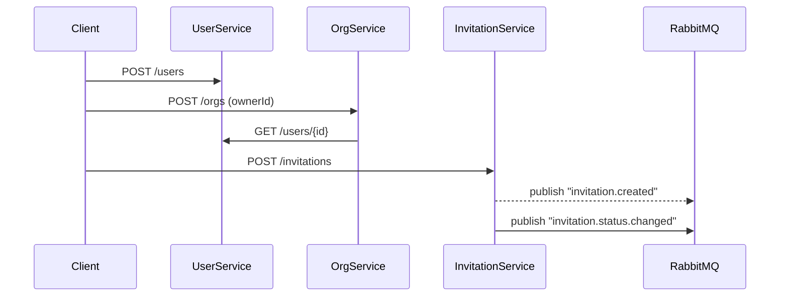
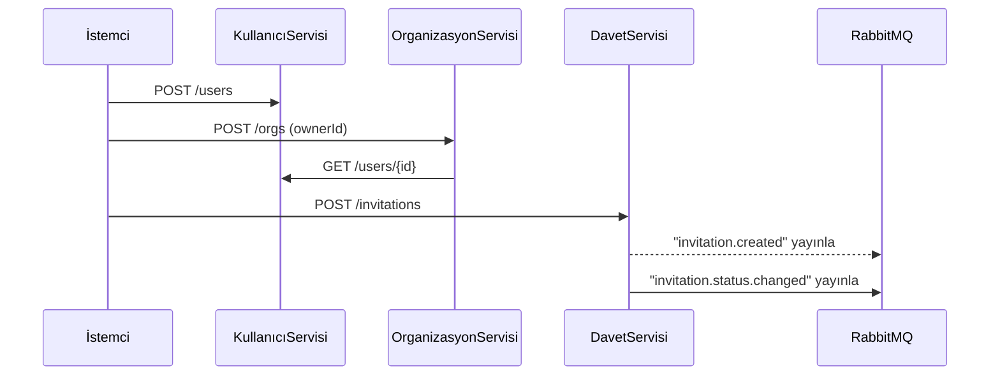

# 🚀 Digitopia Backend Case Study

> **Modern Microservice Architecture with Spring Boot, PostgreSQL, Flyway, RabbitMQ, and Docker Compose**

---

## 📚 Table of Contents
- [Overview](#overview)
- [Microservice Architecture](#microservice-architecture)
- [Technologies](#technologies)
- [Project Structure](#project-structure)
- [Key Features](#key-features)
- [Database Management (Flyway)](#database-management-flyway)
- [API Endpoints & Usage](#api-endpoints--usage)
- [Testing](#testing)
- [Running Locally](#running-locally)
- [Docker Compose Deployment](#docker-compose-deployment)
- [System Flow](#system-flow)
- [Summary](#summary)

---

## 🧭 Overview
This project demonstrates a **scalable, testable, and production-ready microservice architecture** for managing **users, organizations, and invitations**. Each service runs independently with its own database, communicates via **REST** and **RabbitMQ**, and follows best practices for versioning, validation, and observability.

---

## 🧩 Microservice Architecture

| Service | Port | Description | Database |
|---------|------|-------------|----------|
| 🧑 User Service | 8081 | Manages user registration and search operations | userdb |
| 🏢 Organization Service | 8082 | Handles organization creation and owner validation | orgdb |
| 💌 Invitation Service | 8083 | Manages invitations and publishes domain events | invdb |

### Shared Infrastructure
| Component | Port(s) | Purpose |
|-----------|---------|---------|
| 🐇 RabbitMQ | 5672 / 15672 | Message broker for async communication |
| 🐘 PostgreSQL | 5432 | Dedicated DB per service |

---

## ⚙️ Technologies
- **Java 21**, **Spring Boot 3.5.6**
- **Spring Data JPA**, **Hibernate**, **Validation**
- **Flyway**, **PostgreSQL**
- **RabbitMQ** (Topic Exchange)
- **Swagger / Springdoc OpenAPI**
- **JUnit 5**, **Mockito**
- **Docker Compose**

---

## 🧱 Project Structure

```
src/
├── main/java/com/digitopia/<service>/
│   ├── config/        # RabbitMQ, Swagger, DB Configurations
│   ├── domain/        # Entities
│   ├── repo/          # JPA repositories
│   ├── service/       # Business logic
│   ├── web/           # REST Controllers
│   └── exception/     # Global Exception Handling
└── resources/db/migration/ # Flyway SQL migrations
```

---

## 🧠 Key Features
- Independent microservices with isolated databases
- REST + RabbitMQ integration for synchronous and asynchronous communication
- Flyway migrations for database version control
- Centralized exception handling via `@ControllerAdvice`
- Data validation with annotations (`@Valid`, `@Email`, `@NotNull`)
- Comprehensive API documentation (Swagger)
- Healthcheck endpoints for Docker readiness
- Unit test coverage with JUnit 5 and Mockito
- Seamless orchestration via Docker Compose

---

## 🗃️ Database Management (Flyway)
Each service uses **Flyway** for reproducible, version-controlled migrations.

| Service | Table | Description |
|---------|-------|-------------|
| User Service | `users` | Stores user data |
| Org Service | `organizations` | Organization metadata |
| Invitation Service | `invitations` | Invitation records |

**Example migration:**
```sql
CREATE TABLE invitations (
    id UUID PRIMARY KEY,
    organization_id UUID NOT NULL,
    invited_user_id UUID NOT NULL,
    status VARCHAR(20) NOT NULL DEFAULT 'PENDING',
    created_at TIMESTAMP WITH TIME ZONE DEFAULT NOW(),
    updated_at TIMESTAMP WITH TIME ZONE DEFAULT NOW()
);
```

---

## 📬 RabbitMQ Events
| Event | Publisher | Description |
|-------|-----------|-------------|
| invitation.created | invitation-service | Emitted when an invitation is created |
| invitation.status.changed | invitation-service | Emitted when an invitation is accepted or declined |

- **Exchange:** `digitopia.exchange`
- **Routing Pattern:** `invitation.*`

---

## 🧪 Testing

| Service | Test Class | Focus |
|---------|------------|-------|
| User Service | UserServiceTest | Email duplication & normalization |
| Org Service | OrganizationServiceTest | Owner validation & name normalization |
| Invitation Service | InvitationServiceTest | Duplicate prevention & event publishing |

**Run all tests:**
```bash
./gradlew clean test
```

---

## 📖 API Endpoints & Usage

| Service | Swagger UI | Healthcheck |
|---------|------------|-------------|
| 🧑 User Service | http://localhost:8081/swagger-ui.html | /api/v1/users/healtz |
| 🏢 Org Service | http://localhost:8082/swagger-ui.html | /api/v1/orgs/healtz |
| 💌 Invitation Service | http://localhost:8083/swagger-ui.html | /api/v1/invitations/healtz |

### 🔗 Example: Test with curl

**User Service:**
```bash
curl http://localhost:8081/api/v1/users/healtz
```
**Org Service:**
```bash
curl http://localhost:8082/api/v1/orgs/healtz
```
**Invitation Service:**
```bash
curl http://localhost:8083/api/v1/invitations/healtz
```

Replace the endpoint with the actual API you want to test (see Swagger UI for details).

---

## 🐳 Docker Compose Deployment
Everything — services, PostgreSQL, and RabbitMQ — runs via Docker Compose.

**Build and start all services:**
```bash
docker compose up -d --build
```

**Check running containers:**
```bash
docker ps
```

**Access Points:**
| Component | URL | Credentials |
|-----------|-----|-------------|
| RabbitMQ UI | http://localhost:15672 | guest / guest |
| PostgreSQL | localhost:5432 | postgres / postgres |

---

## 🔁 System Flow



---

## 🏁 Highlights
- ✨ Fully containerized deployment
- ✨ Event-driven architecture (publishers ready)
- ✨ REST + Messaging hybrid design
- ✨ Centralized error handling and validation
- ✨ Flyway-based database migration discipline
- ✨ Swagger UI for every microservice
- ✨ Unit-tested, Dockerized, production-ready

---

## 💡 Running Locally

1. **Clone the repository:**
   ```bash
   git clone https://github.com/mkaganm/digitopia.git
   cd digitopia
   ```
2. **Build all services:**
   ```bash
   ./gradlew clean build
   ```
3. **Start infrastructure:**
   ```bash
   docker compose up -d --build
   ```
4. **Access the APIs:**
   - User Service → http://localhost:8081/swagger-ui.html
   - Org Service → http://localhost:8082/swagger-ui.html
   - Invitation Service → http://localhost:8083/swagger-ui.html

---

## 🧾 Summary
Digitopia Backend Case Study showcases a clean, modular, and maintainable architecture that combines RESTful communication and event-driven design. It is fully tested, containerized, and ready for real-world extensions such as membership projection, notification pipelines, and centralized logging.

Built for scalability. Tested for reliability. Designed for clarity.

---

## 🇹🇷 Türkçe

# 🚀 Digitopia Backend Vaka Çalışması

> **Spring Boot, PostgreSQL, Flyway, RabbitMQ ve Docker Compose ile Modern Mikroservis Mimarisi**

---

## 📚 İçindekiler
- [Genel Bakış](#genel-bakış)
- [Mikroservis Mimarisi](#mikroservis-mimarisi)
- [Teknolojiler](#teknolojiler)
- [Proje Yapısı](#proje-yapısı)
- [Temel Özellikler](#temel-özellikler)
- [Veritabanı Yönetimi (Flyway)](#veritabanı-yönetimi-flyway)
- [API Uç Noktaları & Kullanım](#api-uç-noktaları--kullanım)
- [Test](#test)
- [Yerelde Çalıştırma](#yerelde-çalıştırma)
- [Docker Compose ile Dağıtım](#docker-compose-ile-dağıtım)
- [Sistem Akışı](#sistem-akışı)
- [Özet](#özet)

---

## 🧭 Genel Bakış
Bu proje, **kullanıcı, organizasyon ve davet yönetimi** için **ölçeklenebilir, test edilebilir ve üretime hazır bir mikroservis mimarisi** sunar. Her servis kendi veritabanı ile bağımsız çalışır, **REST** ve **RabbitMQ** ile iletişim kurar, versiyonlama, doğrulama ve gözlemlenebilirlik için en iyi uygulamaları takip eder.

---

## 🧩 Mikroservis Mimarisi

| Servis | Port | Açıklama | Veritabanı |
|--------|------|----------|------------|
| 🧑 Kullanıcı Servisi | 8081 | Kullanıcı kaydı ve arama işlemleri | userdb |
| 🏢 Organizasyon Servisi | 8082 | Organizasyon oluşturma ve sahip doğrulama | orgdb |
| 💌 Davet Servisi | 8083 | Davet yönetimi ve domain event yayınlama | invdb |

### Ortak Altyapı
| Bileşen | Port(lar) | Amaç |
|---------|----------|------|
| 🐇 RabbitMQ | 5672 / 15672 | Asenkron iletişim için mesaj kuyruğu |
| 🐘 PostgreSQL | 5432 | Her servis için ayrı DB |

---

## ⚙️ Teknolojiler
- **Java 21**, **Spring Boot 3.5.6**
- **Spring Data JPA**, **Hibernate**, **Doğrulama**
- **Flyway**, **PostgreSQL**
- **RabbitMQ** (Topic Exchange)
- **Swagger / Springdoc OpenAPI**
- **JUnit 5**, **Mockito**
- **Docker Compose**

---

## 🧱 Proje Yapısı

```
src/
├── main/java/com/digitopia/<servis>/
│   ├── config/        # RabbitMQ, Swagger, DB Konfigürasyonları
│   ├── domain/        # Varlıklar
│   ├── repo/          # JPA repository'leri
│   ├── service/       # İş mantığı
│   ├── web/           # REST Controller'lar
│   └── exception/     # Global Hata Yönetimi
└── resources/db/migration/ # Flyway SQL migration dosyaları
```

---

## 🧠 Temel Özellikler
- İzole veritabanları ile bağımsız mikroservisler
- Senkron ve asenkron iletişim için REST + RabbitMQ entegrasyonu
- Veritabanı versiyon kontrolü için Flyway migration'ları
- `@ControllerAdvice` ile merkezi hata yönetimi
- Anotasyonlarla veri doğrulama (`@Valid`, `@Email`, `@NotNull`)
- Kapsamlı API dokümantasyonu (Swagger)
- Docker için healthcheck endpoint'leri
- JUnit 5 ve Mockito ile birim test kapsamı
- Docker Compose ile sorunsuz orkestrasyon

---

## 🗃️ Veritabanı Yönetimi (Flyway)
Her servis, tekrarlanabilir ve versiyonlanabilir migration'lar için **Flyway** kullanır.

| Servis | Tablo | Açıklama |
|--------|-------|----------|
| Kullanıcı Servisi | `users` | Kullanıcı verileri |
| Organizasyon Servisi | `organizations` | Organizasyon bilgileri |
| Davet Servisi | `invitations` | Davet kayıtları |

**Örnek migration:**
```sql
CREATE TABLE invitations (
    id UUID PRIMARY KEY,
    organization_id UUID NOT NULL,
    invited_user_id UUID NOT NULL,
    status VARCHAR(20) NOT NULL DEFAULT 'PENDING',
    created_at TIMESTAMP WITH TIME ZONE DEFAULT NOW(),
    updated_at TIMESTAMP WITH TIME ZONE DEFAULT NOW()
);
```

---

## 📬 RabbitMQ Event'leri
| Event | Yayınlayan | Açıklama |
|-------|------------|----------|
| invitation.created | davet-servisi | Davet oluşturulunca yayınlanır |
| invitation.status.changed | davet-servisi | Davet kabul/red edilince yayınlanır |

- **Exchange:** `digitopia.exchange`
- **Routing Pattern:** `invitation.*`

---

## 🧪 Test

| Servis | Test Sınıfı | Odak |
|--------|-------------|------|
| Kullanıcı Servisi | UserServiceTest | E-posta tekrar kontrolü & normalizasyon |
| Organizasyon Servisi | OrganizationServiceTest | Sahip doğrulama & isim normalizasyonu |
| Davet Servisi | InvitationServiceTest | Çift kaydın önlenmesi & event yayınlama |

**Tüm testleri çalıştır:**
```bash
./gradlew clean test
```

---

## 📖 API Uç Noktaları & Kullanım

| Servis | Swagger UI | Healthcheck |
|--------|------------|-------------|
| 🧑 Kullanıcı Servisi | http://localhost:8081/swagger-ui.html | /api/v1/users/healtz |
| 🏢 Organizasyon Servisi | http://localhost:8082/swagger-ui.html | /api/v1/orgs/healtz |
| 💌 Davet Servisi | http://localhost:8083/swagger-ui.html | /api/v1/invitations/healtz |

### 🔗 Örnek: curl ile test

**Kullanıcı Servisi:**
```bash
curl http://localhost:8081/api/v1/users/healtz
```
**Organizasyon Servisi:**
```bash
curl http://localhost:8082/api/v1/orgs/healtz
```
**Davet Servisi:**
```bash
curl http://localhost:8083/api/v1/invitations/healtz
```

Test etmek istediğiniz uç noktayı Swagger UI'dan bulup değiştirebilirsiniz.

---

## 🐳 Docker Compose ile Dağıtım
Tüm servisler, PostgreSQL ve RabbitMQ, Docker Compose ile ayağa kalkar.

**Tüm servisleri derle ve başlat:**
```bash
docker compose up -d --build
```

**Çalışan container'ları kontrol et:**
```bash
docker ps
```

**Erişim Noktaları:**
| Bileşen | URL | Giriş Bilgisi |
|---------|-----|---------------|
| RabbitMQ UI | http://localhost:15672 | guest / guest |
| PostgreSQL | localhost:5432 | postgres / postgres |

---

## 🔁 Sistem Akışı



---

## 🏁 Öne Çıkanlar
- ✨ Tamamen konteynerleştirilmiş dağıtım
- ✨ Olay tabanlı mimari (yayıncılar hazır)
- ✨ REST + Mesajlaşma hibrit tasarım
- ✨ Merkezi hata yönetimi ve doğrulama
- ✨ Flyway ile veritabanı migration disiplini
- ✨ Her mikroservis için Swagger UI
- ✨ Birim testli, Dockerize, üretime hazır

---

## 💡 Yerelde Çalıştırma

1. **Depoyu klonla:**
   ```bash
   git clone https://github.com/mkaganm/digitopia.git
   cd digitopia
   ```
2. **Tüm servisleri derle:**
   ```bash
   ./gradlew clean build
   ```
3. **Altyapıyı başlat:**
   ```bash
   docker compose up -d --build
   ```
4. **API'lere eriş:**
   - Kullanıcı Servisi → http://localhost:8081/swagger-ui.html
   - Organizasyon Servisi → http://localhost:8082/swagger-ui.html
   - Davet Servisi → http://localhost:8083/swagger-ui.html

---

## 🧾 Özet
Digitopia Backend Vaka Çalışması, RESTful iletişim ve olay tabanlı mimariyi birleştiren, temiz, modüler ve sürdürülebilir bir mimari sunar. Proje tamamen test edilmiş, kontenerleştirilmiş ve üye projeksiyonu, bildirim akışları ve merkezi loglama gibi gerçek dünya ihtiyaçlarına kolayca genişletilebilecek şekilde tasarlanmıştır.

Ölçeklenebilirlik için inşa edildi. Güvenilirlik için test edildi. Anlaşılırlık için tasarlandı.
